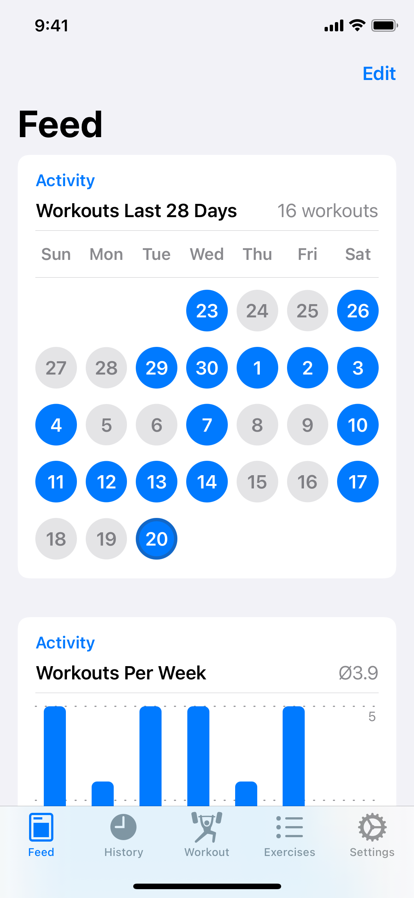
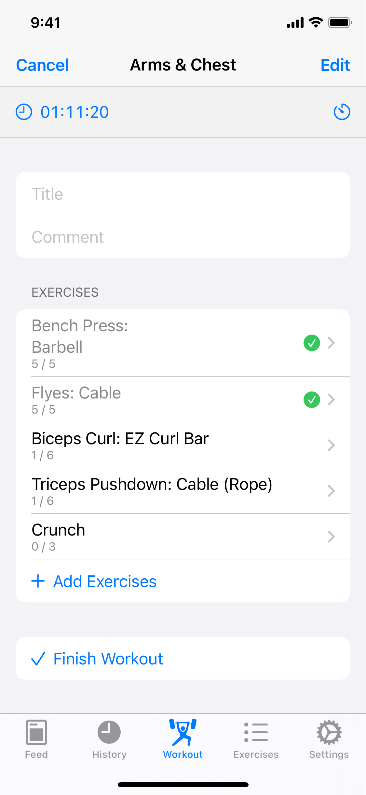

  

  

# Iron

A modern and completely free weightlifting workout tracker for iOS, written in SwiftUI.

|  |  |  |
|-|-|-|

## Building

**Xcode 13** or later is required.

- Select the Iron project in the Xcode sidebar
- Under "Targets", select "Iron"
- Set the "Bundle Identifier" to something unique like `com.yourname.Iron`
- Go to the Signing & Capabilities tab and select your development team under Signing > Team
- Repeat the same process for the other targets where applicable
- Build the `Iron` scheme
